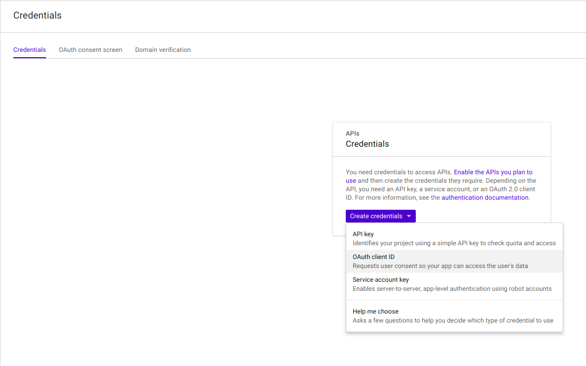
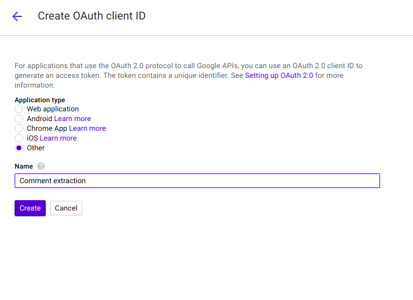
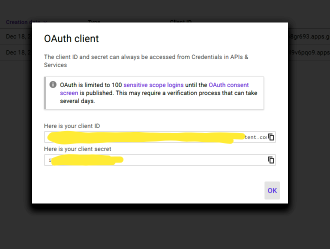

# Extract comments :  

## Install required packages :

                pip3 install -r requirements.txt

## Run script :

                python comments.py --videoid='<video_id>'

# YOUTUBE DATA API configuration :

The OAuth 2.0 information for this application, including its client_id and client_secret. You can acquire an OAuth 2.0 client ID and client secret from the Google Cloud Console at
                [https://console.cloud.google.com/apis/dashboard](https://console.cloud.google.com/apis/dashboard).

Please ensure that you have enabled the YouTube Data API for your project.
For more information about using OAuth2 to access the YouTube Data API, see:
        [https://developers.google.com/youtube/v3/guides/authentication](https://developers.google.com/youtube/v3/guides/authentication)

STEP 1 : 

Create credentials -> OAuth2 Client ID

  

STEP 2 :  

1. Enable Youtube Data API
2. Select Others

  

STEP 3 : 

1. Copy your client ID and client secret
2. Paste it in the [client_secrets.json](./client_secrets.json)

  

For more information about the client_secrets.json file format, see:
        https://developers.google.com/api-client-library/python/guide/aaa_client_secrets
